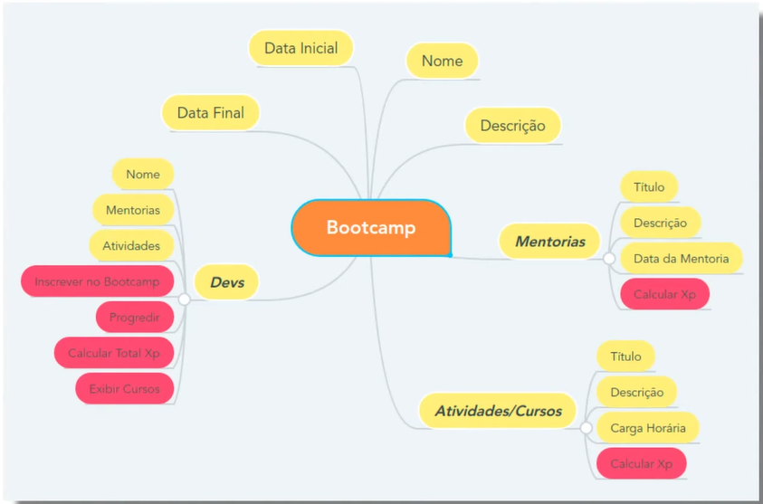

# 🍵 Desafio de Projeto - Abstraindo um Bootcamp Usando Orientação a Objetos em Java

## 📄 Descrição
- A proposta deste desafio é desmistificar a Programação Orientada a Objetos (POO) com Java e praticar esse conceito fundamental. Para isso, os pilares da OO são devidamente formalizados: Abstração, Encapsulamento, Herança e Polimorfismo. Neste desafio, será desenvolvido a capacidade de abstração com um problema real e implementar as evoluções que achar interessantes.

## ℹ️ Desmitificando o Desafio
 

---

### ➡️ Entendendo o diagrama
- **Descrição:** o diagrama acima representa as classes de um sistema de plataforma de bootcamps. Através da abstração e outros conceitos da Orientação a Objetos foi possível construí-las neste [repositório](./src/br/com/dio/challenge/domain/). Entretanto a interpretação e desenvolvimento do sistema levou a criação de outras classes como [*Conteudo*](./src/br/com/dio/challenge/domain/Conteudo.java) para diminuir o acoplamento e aumentar a coesão.

- **Identificando as Classes do Diagrama:**
    - A forma retangular em laranja representa a classe [*Bootcamp*](./src/br/com/dio/challenge/domain/Bootcamp.java). 
    - A forma retangular em amarelo e escrito em negrito representa a classe [*Dev*](./src/br/com/dio/challenge/domain/Dev.java).
    - A forma retangular em amarelo e escrito em negrito representa a classe [*Mentoria*](./src/br/com/dio/challenge/domain/Mentoria.java).
    - A forma retangular em amarelo e escrito em negrito representa a classe [*Curso*](./src/br/com/dio/challenge/domain/Curso.java).
    
    Os métodos e atributos estão devidamente selecionados e inseridos nos arquivos de cada classe.

### 🎯 Validando a Solução

---
 

---

Entre aqui para conferir o aqui [App.java](./src/App.java)